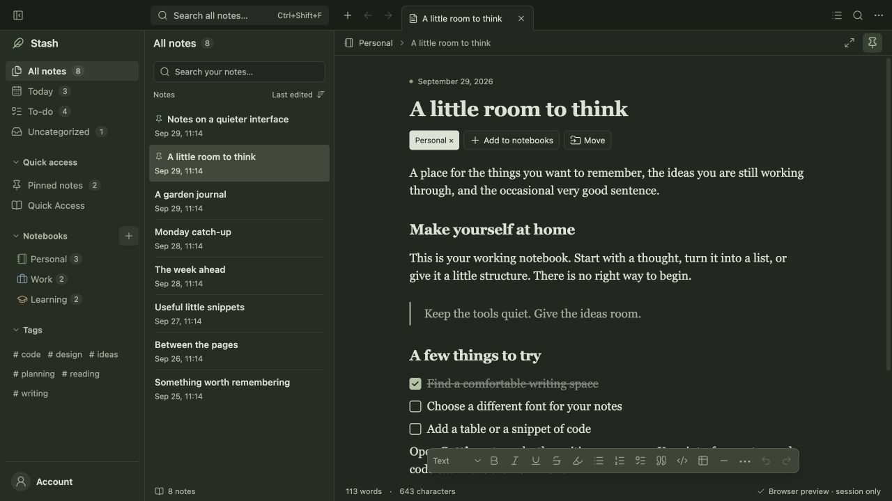
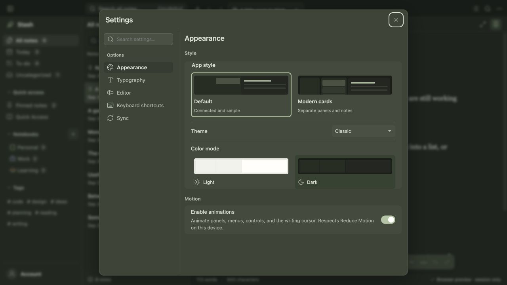
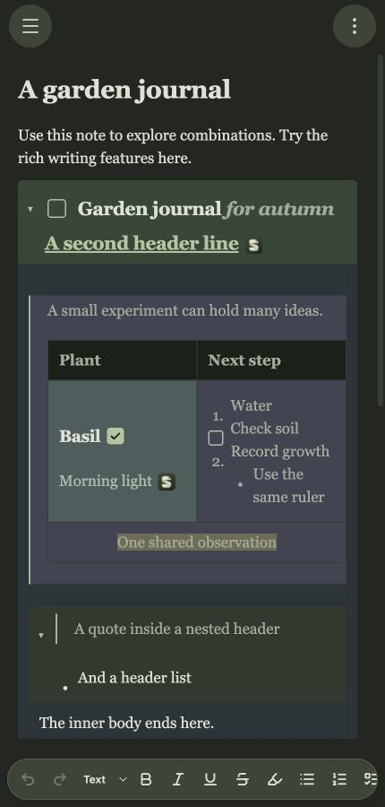

# Stash

A local-first macOS and Android notes app using Tauri 2, React, TypeScript, Tiptap and Rust/SQLite. Notes, notebooks, body hashtags and appearance settings are saved on the current device. Autosave includes revision checks, visible failures and a save-before-quit guard. Self-hosted sync is optional and inactive until a user explicitly saves a server URL and device token. On macOS, open the account menu and click **Sync** to configure it; offline editing remains available. See [self-hosted sync](documents/SYNC.md) for setup, recovery and operations. See [local storage](documents/LOCAL_STORAGE.md) for the save contract, recovery behavior and limits.

## Features at a glance



<table>
  <tr>
    <td width="67%"></td>
    <td width="33%"></td>
  </tr>
  <tr>
    <td><strong>Make it yours.</strong> Choose an app style, theme, color mode, fonts, spacing, shortcuts, and motion settings.</td>
    <td><strong>Write anywhere.</strong> The mobile editor supports the same rich notes, tables, tasks, sections, and formatting tools.</td>
  </tr>
</table>

Screenshots use the browser preview's fictional, session-only sample library.

## Run

For UI changes, follow the shared sizing, surface, accessibility, and mobile rules in [DESIGN.md](DESIGN.md).

```sh
npm install
npm run tauri dev
```

For a browser preview, use `npm run dev` and open http://127.0.0.1:1420. Run `npm run build` to type-check and build the frontend. Run `cargo check --manifest-path src-tauri/Cargo.toml` to check the native shell.

## Android

See [Android development and builds](documents/ANDROID.md) for native setup, the mobile browser preview, debug APKs, and acceptance checks.

## Release app

After installing dependencies with `npm install`, build the macOS release app:

```sh
make release
```

The app is generated at `src-tauri/target/release/bundle/macos/Stash.app`.

## Working prototype

- Three-pane workspace with notebook, tag, date, checklist, pinned, and trash filters.
- Link a local folder from **New notebook** to edit its Markdown files in place. Nested folders containing Markdown become sub-notebooks. Ordinary notebooks can also have children. See [folder notebooks](documents/FOLDER_NOTEBOOKS.md) for file operations, conflict recovery, and validation status.
- Create notes and notebooks, search notes, switch notes, assign multiple notebooks, add hashtags in note text, pin, save to Quick Access, duplicate, move to trash, and restore. Cmd/Ctrl-click a hashtag to open its tag view. Notebook menus also support new notes, editing the name/icon/color, and recoverable notebook deletion with child-promotion and note-retention choices.
- Right-click note rows (or press Shift+F10) for note actions. Copy a note link and paste it into another note to create a clickable reference.
- Rich-text editing with optional Markdown shortcuts and paste conversion, searchable slash commands, compact paragraphs, mixed lists, inline checkboxes, colors, links, tables, session images and rich collapsible sections.
- Per-note undo history, selection and collapse state survive note switches.
- Independent interface, note, and code font settings, note size and writing width.
- Light/dark appearance, sidebar visibility, and focus mode.
- Settings → Appearance → App style offers Default and Modern cards previews. The choice applies immediately, saves on this Mac, and stays independent of colors, fonts, and writing settings.
- Subtle animations for panels, menus, dialogs, note organization, and editor controls. Settings → Appearance → Motion provides a saved on/off switch; macOS Reduce Motion always takes priority. Disabling animations also pauses custom cursor motion without changing saved cursor settings.

A new native library starts empty; use **Add sample notes** to add fictional examples. Browser previews still use session-only sample data. This is a first review of the UI, not a complete implementation of every retained feature. See documents/PROTOTYPE_SCOPE.md for the larger scope and deferred work. The UI remains React/Tiptap, with a small AppKit bridge for safe macOS termination.

## Writing review

After adding sample notes, open **A garden journal** to try nested rich content. See [the writing guide](documents/WRITING_EXPERIENCE.md) for controls, architecture and verification limits. Run `npm test` for the editor behavioral tests.
